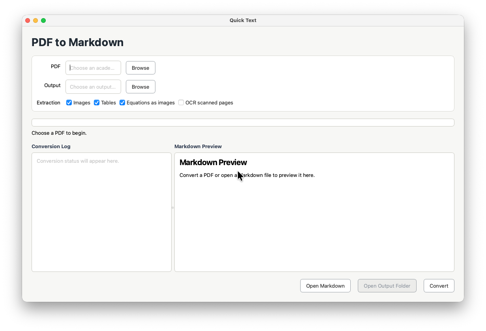
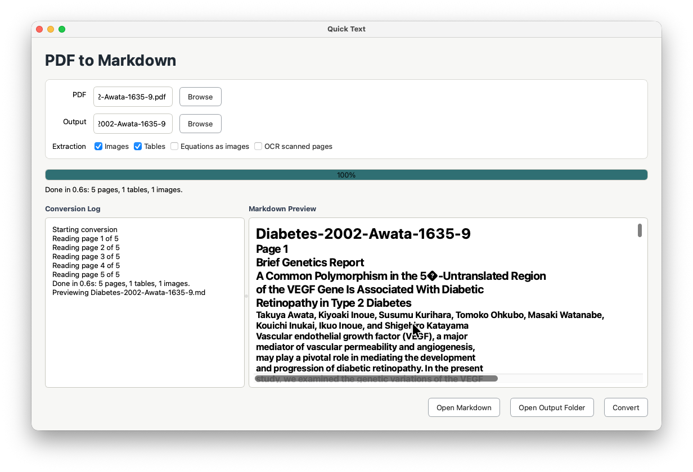

# Paper Markdown Extractor

[](https://github.com/cema-sait/quick-text/actions/workflows/tests.yml)

A small Qt desktop GUI for converting academic PDFs into clean Markdown. It extracts:

- Native PDF text with heading heuristics
- Tables, using PyMuPDF table detection
- Images into an adjacent `images/` directory
- Display equations cropped as broad row images for higher visual fidelity, including right-edge equation numbers, with text math blocks available as a fallback
- Optional OCR fallback for scanned pages when Tesseract is installed
- Integrated Markdown preview with local images, equation crops, and tables rendered from the generated output

The fast path is built for digitally generated academic papers. A 10-page text PDF should usually finish well under one minute on a modern laptop. Scanned PDFs are slower because OCR requires page rendering.

## Setup

```bash
python3 -m venv .venv
source .venv/bin/activate
python -m pip install -r requirements.txt
```

Optional OCR engine for scanned PDFs:

```bash
brew install tesseract
```

## Run

```bash
python -m paper_md_extractor
```

Choose a PDF, choose an output folder, then click **Convert**. The app previews the generated Markdown and writes:

- `<paper-name>.md`
- `images/` with extracted page images

## Screenshots





## Notes

PDFs do not reliably encode equations, reading order, or table structure semantically. This app favors a fast deterministic extraction pipeline and keeps the output editable. For image-only scanned papers, enable OCR and expect slower conversion.
